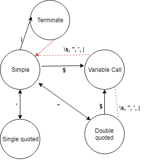
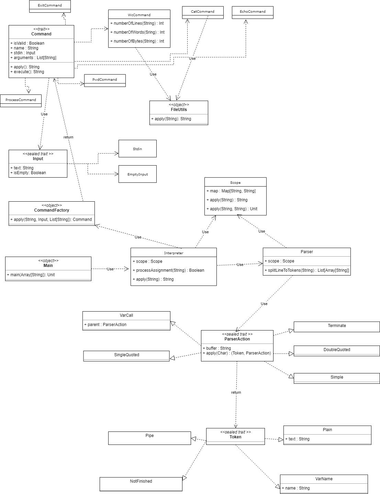

# Интерпретатор командной строки
## Описание
Интерпретатор должен поддерживать следующие команды bash'а:
* cat [FILE] - вывести на экран содержимое файла
* echo - вывести на экран аргумент (или аргументы)
* wc [FILE] - вывести на экран число строк, слов и байт в файле
* pwd - распечатать текущую директорию
* exit - выйти из интерпретатора

Кроме того, должны поддерживаться одинарные и двойные кавычки (full and weak quoting, то есть одинарные кавычки передают текст как есть, двойные выполняют подстановки переменных окружения с оператором $), собственно окружение (команды вида “имя=значение”), оператор $, вызов внешней программы через Process (или его аналоги) для любой команды, которую интерпретатор не знает. Должны ещё поддерживаться пайплайны  (оператор “|”), то есть перенаправление ввода и вывода.

## Архитектура
Первый шаг - нужно распарсить аргументы командной строки.
У нас должны поддерживаться кавычки, переменные окружения и pipe'ы. 
Можно распарсить строку линейным проходом (так как нет сложных синтаксических конструкций, и, следовательно, дерева выражений) при помощи конечного автомата.
Состояниями у него будут -- читаем без кавычек, читаем в одинарных кавычках, читаем в двойных кавычках, читаем имя переменной и состояние _terminate_, обозначающее pipe.

Каждое состояние при добавлении символа помимо следующего состояния выдаёт токен, которому оно соответствует.
При этом токен считается заверщённым, если был совершён переход в другое состояние. Также есть токен, соответствующий переменной окружения, и его значение заменяется на значение из `Scope`. При этом в конце все завершённые токены между pipe'ами склеиваются и делятся заново, так как `ec'ho'` должно интерпретироваться как `echo`. 

После этого токены должны быть интерпретированы как команды, присвоения и аргументы.

